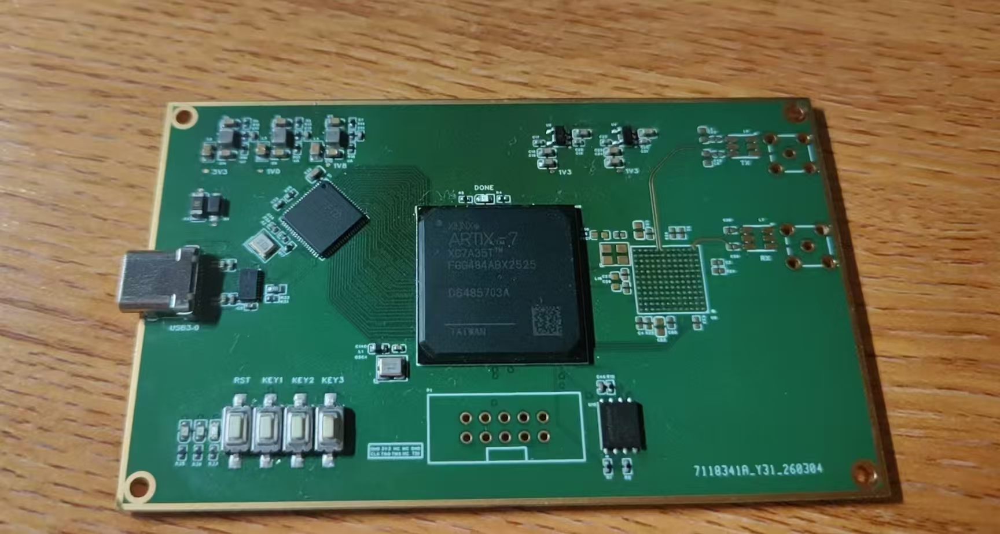

# 基于 FPGA 的软件定义无线电

这是一个基于以下器件构建的 FPGA 软件定义无线电（SDR）平台：

- 📡 射频收发器：`AD9363`
- 🔧 FPGA：`Xilinx Artix-7`
- 🔌 USB 接口：`FTDI FT601`

本项目旨在构建一个紧凑的 SDR 硬件与 FPGA 平台，通过 USB 在 AD9363、FPGA 逻辑与主机之间传输基带数据。

## 📷 硬件



硬件采用从射频前端直连主机的 SDR 信号链设计。AD9363 负责射频信号的收发转换，并向 FPGA 提供数字 I/Q 采样数据。Artix-7 FPGA 是板上的核心器件，负责时钟域处理、数据缓冲、控制逻辑、后续基带处理，以及在射频前端和 USB 接口之间传输采样数据。

FT601 用作 FPGA 与主机之间的高速 USB 桥接器。它在 FPGA 侧提供并行 FIFO 风格的接口，因此无需在 FPGA 逻辑中实现完整的 USB 协议栈，便可传输大块基带数据。主机侧使用 FTDI D3XX 驱动程序完成设备枚举、连接测试，并支持后续的数据传输工具。

当前 PCB 集成了 SDR 的主要器件、电源、FPGA 配置电路、USB 接口，以及初期硬件调试所需的板级布线。第一版硬件已经完成组装，并已在基础通信层面验证 FT601 到 FPGA 的数据通路。下一版硬件将重点修正 FPGA Bank 电源规划，并改善 FT601 的 USB 3.0 链路性能。

| 功能模块 | 器件 | 作用 |
| --- | --- | --- |
| 射频前端 | `AD9363` | 射频收发转换和数字 I/Q 接口 |
| 数字逻辑 | `Xilinx Artix-7` | 数据缓冲、控制逻辑和 FPGA 侧 SDR 处理 |
| USB 桥接 | `FTDI FT601` | FPGA 与主机之间的并行 FIFO 接口 |
| 配置存储 | 外部 Flash | 存储 FPGA 比特流，目前受 Bank 电源规划影响 |

## ✅ 项目路线图

- [x] 完成 FPGA 侧硬件的 BGA 焊接
- [x] 在主机侧成功识别 FT601 设备
- [x] 完成 FT601 到 FPGA 的基础通信测试
- [x] 添加用于检测 FT601 / D3XX 设备的 Python 测试代码
- [ ] 调试 FT601 的 USB 3.0 SuperSpeed 工作模式
- [ ] 测试并完成 AD9363 的初步调通
- [ ] 开始编写 SDR 数据通路的 FPGA RTL
- [ ] 根据当前硬件问题更新原理图
- [ ] 重新规划 FPGA Bank 电源和 Flash 连接
- [ ] 继续进行 SDR 系统级验证

## ⚠️ 当前问题

### 🔌 FT601 链路速率

FT601 目前只能以 USB 2.0 模式完成枚举和工作。

预期工作模式为 USB 3.0 SuperSpeed，因此仍需进一步调试。可能需要检查的方面包括 USB 3.0 布线、连接器信号完整性、线缆质量、FT601 配置，以及主机侧的驱动程序和设备识别情况。

### ⚡ FPGA Bank 电源规划

当前硬件版本中的 FPGA Bank 电源规划不够合理。

该问题会影响外部 Flash 接口；在现有的 Bank 和电源配置下，Flash 无法正常工作。下一版硬件需要修改原理图及 Bank 分配。

## 通信协议

主机与 FPGA 通过 FT601 USB 数据通路交换控制消息和数据消息。通信协议采用数据包形式，因此 FPGA 的数据包处理层可以先解析每次 USB 传输，再将其路由至控制寄存器、采样缓冲区或后续的 SDR 处理模块。

### USB 数据包结构

USB 数据包格式仍在设计中。本节记录 FPGA `usb_packet_layer` 与主机侧传输工具所使用的数据包字段。

### 接收部分

| 字段 | 宽度 | 说明 |
| --- | --- | --- |
| 数据包头 | 32 位 | `32'hAAAA5555` |
| 数据包信息 | 32 位 | `[7:0]`：数据包类型；FPGA 返回包还携带双向 FIFO 信用 |
| 负载长度 | 32 位 | 数据包头之后的 32 位负载字数 |

各类数据包的负载格式如下：

| 类型 | 宽度 | 说明 |
| --- | --- | --- |
| `RX_READ_REG` | 32 位 | `[9:0]`：地址 |
| `RX_WRITE_REG` | 32 位 | `[9:0]`：地址，`[17:10]`：数据 |
| `RX_TX_DATA` | 32 位 | `[23:12] = I`、`[11:0] = Q`、`[31:24]` 保留 |
| `RX_LOOP_TEST` | 32 位 | |

Packet Layer 将主机发来的读写寄存器请求转换后写入内部 `RX_REG_CMD` FIFO，其命令字格式如下：

FPGA 返回到主机的每个数据、寄存器响应或 ACK 包都会在 `info` 字中捎带双向流控信用：

| 位域 | 说明 |
| --- | --- |
| `[31:30]` | 保留，置 `0` |
| `[29:19]` | AD9363 → PC 的 `tx_data_fifo` 可用字数 |
| `[18:8]` | PC → AD9363 的 `rx_data_fifo` 可用字数 |
| `[7:0]` | 数据包类型 |

主机应根据 `[18:8]` 调整向 FPGA 发送 IQ 的速度，并根据 `[29:19]` 和接收积压情况决定是否通过 SPI 降低 AD9363 采样率。

| 位域 | 说明 |
| --- | --- |
| `[31]` | 操作类型：`0` 表示读寄存器，`1` 表示写寄存器 |
| `[30:18]` | 保留，置 `0` |
| `[17:10]` | 写寄存器数据；读操作时置 `0` |
| `[9:0]` | AD9363 寄存器地址 |

读寄存器操作完成后，SPI 接口将结果写入 `TX_REG_DATA` FIFO。返回字格式为：

| 位域 | 说明 |
| --- | --- |
| `[31:18]` | 保留，置 `0` |
| `[17:10]` | 读取到的 8 位寄存器数据 |
| `[9:0]` | AD9363 寄存器地址 |

## FPGA 框架

FPGA 代码正在围绕流式数据框架进行组织。设计的主要方向是将外部器件接口、时钟域交叉、数据缓冲以及后续的 SDR 处理模块相互分离，使各部分能够独立测试和替换。

现阶段的 FPGA 框架以 FT601 USB 数据通路为核心。FT601 工作在其自身的 FIFO 总线时钟域，而 FPGA 内部 SDR 逻辑预计工作在系统时钟域。因此，USB 数据通路使用异步 FIFO 作为 FT601 接口与 FPGA 其余逻辑之间的边界。

计划中的顶层模块：

- [x] FT601 FIFO 接口逻辑
- [x] AD9363 控制与数据接口
- [ ] 时钟与复位架构
- [x] RX/TX 采样数据通路
- [x] 数据缓冲与数据包格式
- [ ] 主机通信协议
- [ ] 调试与测试模块

### `usb_fifo`

`usb_fifo.sv` 实现 FT601 侧的 USB 流式传输接口，以及第一层时钟域交叉逻辑。

该模块包含两个异步 FIFO：

- RX FIFO：将数据从 FT601 时钟域传输至 `sys_clk` 时钟域。
- TX FIFO：将数据从 `sys_clk` 时钟域传输至 FT601 时钟域。

FT601 控制逻辑由状态机实现，包含以下状态：

- `FT601_IDLE`
- `FT601_WRITE_WAIT`
- `FT601_WRITE`
- `FT601_READ_OE`
- `FT601_READ`

读通路在从 FT601 读取数据前检查 `FT601_RXF_N == 0`，同时确认 RX FIFO 尚未接近满状态，之后才接收更多数据。这可以防止 FT601 读端继续向即将写满的 FIFO 推送数据。

写通路仅在 `FT601_TXE_N == 0` 且 TX FIFO 非空时启动。由于 FIFO 输出数据在发出读请求后才有效，状态机使用 `FT601_WRITE_WAIT` 等待 `tx_fifo_valid`，随后才驱动 `FT601_DATA` 并置有效 `FT601_WR_N`。

FIFO 控制信号独立于 FT601 总线控制的 `always` 块。由此，设计被划分为：

- FT601 总线控制：控制 `FT601_WR_N`、`FT601_RD_N`、`FT601_OE_N`、数据总线方向和字节使能。
- RX FIFO 写控制：将 FT601 数据写入 RX FIFO。
- TX FIFO 读控制：请求 TX FIFO 数据并锁存，随后写入 FT601。

### `ad9363_spi_if`

`ad9363_spi_if.sv` 连接 Packet Layer 的 `RX_REG_CMD` 和 `TX_REG_DATA` FIFO 接口，并自动执行 AD9363 单寄存器读写操作。

SPI 接口按照 AD9363 Reference Manual UG-1040 的串行外设接口时序工作：默认采用 4 线、MSB first 格式，数据在 SPI 时钟上升沿推出、下降沿采样，`SPI_ENB` 在最后一个下降沿之后恢复高电平。在 50 MHz `sys_clk` 下生成周期为 100 ns 的 10 MHz SPI 时钟。

每次单寄存器操作传输 24 位。前 16 位控制字格式为 `[15]` 写/读标志、`[14:12]` 单字节传输长度 `3'b000`、`[11:10]` 保留位 `2'b00` 和 `[9:0]` 寄存器地址，随后传输 8 位写入数据或读出数据。写操作完成后直接处理下一条命令；读操作会等待 `TX_REG_DATA` FIFO 可写，再按上述返回格式提交结果。

### `ad9363_data_if`

`ad9363_data_if.sv` 按照 AD9363 Reference Manual UG-1040 的 CMOS 双端口、全双工 SDR 模式实现 1R1T 数据接口。Port 0 用于 AD9363 到 FPGA 的接收数据，Port 1 用于 FPGA 到 AD9363 的发送数据。每个时钟上升沿传输一个 12 位二进制补码采样字，I/Q 顺序为 I、Q、I、Q。

RX 方向要求 AD9363 使用重复的 50% 占空比 `RX_FRAME`：高电平周期表示一帧开始并传输 I，随后的低电平周期传输 Q。接口将两个连续采样拼成一个 24 位字写入 `async_fifo_24x128`，格式为 `[23:12] = I`、`[11:0] = Q`。FIFO 另一端工作于 `sys_clk` 域。RX FIFO 写满时无法反压 AD9363，因此会丢弃完整 I/Q 对并置位粘滞的 `rx_fifo_overflow`。

TX 方向使用相同的 24 位格式。接口从 `async_fifo_24x128` 取出一个 I/Q 对，在连续两个 `DATA_CLK` 周期依次输出 I 和 Q，并自动产生高、低电平交替的 `TX_FRAME`。TX 数据和 `TX_FRAME` 在 `DATA_CLK` 下降沿更新，使其在下一个 `FB_CLK` 上升沿到来前获得半个周期的建立时间。

`FB_CLK` 直接由模块内的 ODDR 原语根据 `DATA_CLK` 转发，不再需要额外的 `tx_fb_clk` 或 MMCM 相移输入。正常全双工 FDD 工作期间，模块保持 `ENABLE = 1`；`TXNRX` 在该模式下会被 AD9363 忽略，但仍保持确定的高电平。

### 顶层层级

`ad9363_top.sv` 仅封装 `ad9363_spi_if` 和 `ad9363_data_if`，并向系统层提供 SPI 命令及双向 IQ FIFO 接口。`sdr_top.sv` 是板级综合顶层，直接实例化 USB FIFO Layer、Packet Layer 和 `ad9363_top`，并在顶层完成双向 IQ 的流控与位宽转换。

## 📁 仓库结构

```text
fpga-based-sdr/
|-- FPGA/          FPGA 工程文件和 RTL 实验代码
|-- images/        项目图片和文档资源
|-- python_test/   主机侧 FT601 / D3XX Python 测试代码
|-- FTD3XX.dll     本地 FTDI D3XX 运行库
`-- README.md
```
